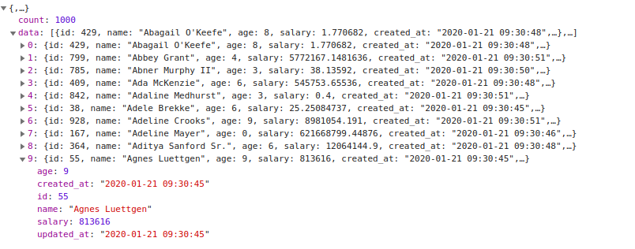

# Vuejs Simple Datatable

Creating vuejs simple datatable came out of necessity while developing a web application for a growing startup. I discovered that while there are some great table libraries out there, some required heavy customization, were missing out of the box features such as built in sorting and pagination.

If you want to achieve balance with the force and want a simple but flexible table library give React Data Table Component a chance. If you require an Excel clone or heavy "enterprise" capabilities, then this is not the React table library you are looking for
# Key Features!

  - Sorting
  - Searching
  - Pagination
  - Custom component implementation.
  - Currency formating
  - Time formating


### Installation
Install vuejs simple datatable using node package manager (npm). Go to your vue project root directory and run
```sh
$ npm install vuejs-simple-datatable
```

### Usages
In your main.js, or a similar entry point for your app:
```sh
$ import VuejsSimpleDatatable from "vuejs-simple-datatable";
$ Vue.use(VuejsSimpleDatatable);
```
Now, the <vuejs-simple-datatable/> should be able in any of your .vue files. This component takes props "options" from parent component about table configuration.

### Example
Use Component in your vue template
```
<vuejs-simple-datatable :options="tableOptions"/>
```
And data properties "tableOptions" takes details  like
```
tableOptions: {
        tableName: 'users',
        columns: [
                {
                title: 'Name',
                key: 'name',
                type: 'clickable',
                source: 'users',
                uniqueField: 'id',
                sortable: true
                },
                {title: 'Age', key: 'age', type: 'text',sortable: true},
                {title: 'Salary', key: 'salary', type: 'text',textAlign:'center',currencyFormat:true, currencyConfig : { format: '%v %c', code: 'USD' }, sortable: false},
                {title:'Created at', key:'created_at',type:'text',dateFormat:true,currentFormat:'YYYY-MM-DD h:mm:ss',expectFormat:'DD MMM YYYY'},
                {title: 'Action',  type: 'component', name:HomeAction},
                ],
        source: 'http://demo.datatable/api/users',
        search: true,
    },
```
### Columns

| Type | Description |
| ------ | ------ |
| clickable | clickble makes your data linked to another page. You need to provide "source" to another page. if that page is dynamically changes by its routes params then provide "uniqueField". See the example section.|
| Text | its a normal text field. |
| Component | You can use custom component in your datatable. just set the type 'component' and provide the name of your component  in "name" field  |

### Properties

| Name | Description |
| ------ | ------ |
|title| this fields value set as your datatable title.|
| key | this key name match your backend response key name and set value in row|
| sortable | Make your column  sortable true if you want to sort your column |
| textAlign | You can set your column text alignment by providing value left,right or center |
|currencyFormat| Format your column data by currency then set it true and provide the configuration in currencyConfig like currencyConfig : { format: '%v %c', code: 'USD' }. See  [details](https://www.npmjs.com/package/format-currency)|
|dateFormat|Format your column data by date then set it true and provide the the current response format and expected response format like  currentFormat:'YYYY-MM-DD h:mm:ss',expectFormat:'DD MMM YYYY'. See  [details](https://momentjs.com/)|
|source|Provide your backend data API|
|sortedKey|Set sort data key to initilally sort data and also "set sortedType" asc or desc |
|search|Search you table data by set search true|

### Your post methed 
Prepare your backend api to sync with datatable. Your post methed payload is
```
search: ""
skip: 0
sortedKey: "name"
sortedType: "asc"
take: 10
```
Prepare your api data by using this payload. use sortedKey and sortedType to short your data. implement search to filter your data. take is use to get total data  and skip is used to ignore first selected data. if skip = 20 and take = 10 then you need to return data from 21-30.

Return total data count for implementing pagination. API response like


Simple laravel api implementation. you can use your preferred language or framework.
```
  public function getData(Request $request)
    {
        $take = $request->input('take');
        $skip = $request->input('skip');
        $search = $request->input('search');
        $sortedKey = $request->input('sortedKey');
        $sortedType = $request->input('sortedType');

        $data = $query = User::where(function ($query) use ($search) {
            $query->where('name', 'LIKE', "%{$search}%");
        })->skip($skip)->take($take)->orderBy($sortedKey, $sortedType)->get();

        $count = $query = User::where(function ($query) use ($search) {
            $query->where('name', 'LIKE', "%{$search}%");
        })->count();

        return response()->json(['data' => $data, 'count' => $count], 200);
    }
```
Any help or Suggestion?
[Github](https://github.com/sandipcse12/vuejs-simple-datatable)
Happy Coding!!!
